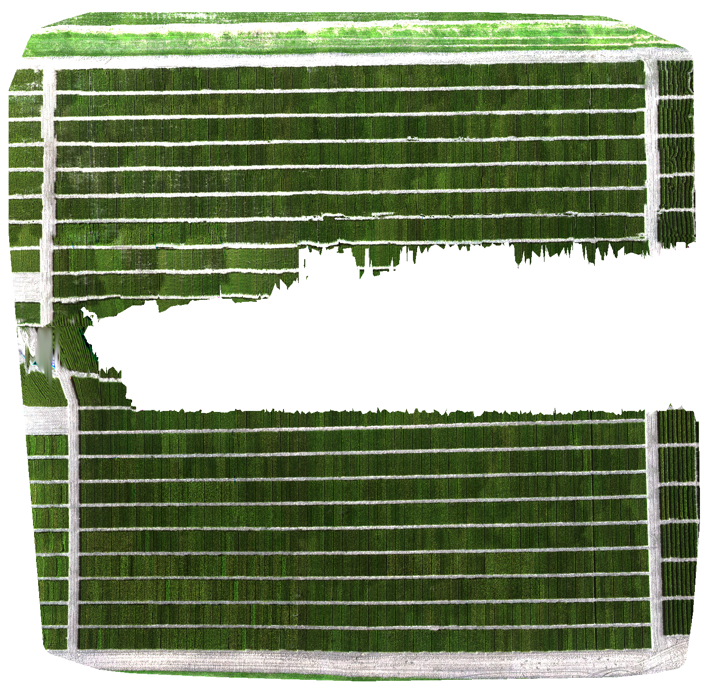

This tutorial contains instructions of how to perform Drone Image analysis for a multispectral sensor. It includes our notes and tips of how to make it simple for a new user. Here we cover the concepts related to mission planning, stitching and plot extraction.

<!--more-->

# Mission

## Before flying: Planning!

You can agree that capturing images with a drone is a fun activity! When we want to capture images from multiple flights and use it for research, is important that we follow some good standards. Here, we want to share how we performed our research in the summer of 2023. We used a DJI Matrice 200 V2 equipped with a Micasense Altum! 

We performed our flights over a winter wheat trial. As any of our drones was equipped with RTK, we first put ground control points (GCPs) in the field and surveyed them using a Multi-band RTK GNSS receiver. MS [Frank Dougher](https://landresources.montana.edu/directory/faculty/2324972/frank-dougher) helped us to survey the points at the field. We used at least five GCPs, four located at the corners of the field and a central GCP.  According to [Pugh *et al* (2021)](https://acsess.onlinelibrary.wiley.com/doi/full/10.1002/ppj2.20026), four GCPs located at the corners of the field should be enough.

## Understanding your sensor and flying

Micasense multispectral sensors are commercialized by [AgEagle](https://ageagle.com/solutions/micasense-series-multispectral-cameras/) and have been used for agricultural applications. We have experience using three sensors in our lab - RedEdge-3, Altum and RedEdge-P. They differ in the resolution of their cameras, but the three of them have five bands in common: Blue, Red, Green, Near Infrared and RedEdge. Altum has an extra thermal sensor, while RedEdge-P has a panchromatic camera.

The settings of a mission should be adjusted according to the sensor. We want a good frontal and side overlap for stitching images later, so we need to fly the drone in a way that we will guarantee these overlaps. We will basically control the number of paths on the flying app according to information like the size of the sensor, resolution, focal length, the triggering interval and the desired overlap. To start, let's take a look in the information of [Micasense Altum](https://support.micasense.com/hc/en-us/articles/360010025413-Altum-Integration-Guide) (serial number AL05) from the official website:

|                       |             Multispectral            | Thermal               |
|:---------------------:|:------------------------------------:|-----------------------|
|            Pixel size |                3.45 μm               |         12 μm         |
|            Resolution | 2064 x 1544 px  (3.2 MP x 5 imagers) | 160 x 120 px (0.01 K) |
|          Aspect ratio |                 4 : 3                |         4 : 3         |
|           Sensor size |   7.12 x 5.33 mm  (8.9 mm diagonal)  |     1.92 x 1.44 mm    |
|          Focal length |                 8 mm                 |        1.77 mm        |
| Field of view (h x v) |              48º x 36.8º             |      57º x 44.3º      |
|   Thermal sensitivity |                  n/a                 |        < 50 mK        |
|      Thermal accuracy |                  n/a                 |        +/- 5 K        |
|      Output bit depth |                12-bit                |         14-bit        |
| GSD @ 120 m (~400 ft) |                5.2 cm                |         81 cm         |
|  GSD @ 60 m (~200 ft) |                2.6 cm                |         41 cm         |

For example, we used the DJI GS Pro to perform our missions. In this app, we can enter a custom camera and the information we needed was the resolution, the sensor size (it's the size of each one of the five little cameras, not the structural size of the sensor) and focal length. See that we have two kinds of sensors, where thermal has less resolution than the multispectral ones. You need to choose which one of them helps you to achieve your research goals. For us, the objective was to use the data from the five multispectral band, so all our mission planning was focused on them.

 We configured the Altum to capture images in the overlap mode, asking for at least 85% overlap (do not forget to set up the target height). In the GS Pro app we set settings to 80% frontal and side overlap, keeping the speed of the drone around 3 to 4 mph. A very important point here is that you need to define the height of your missions! We had good experiences flying 90 and 50 ft, but there is no rule of thumb as it depends on the crop and objectives of the research. Choosing the height, increasing the overlap and controlling the speed might affect a lot the time of the flight, so you need to study how to optimize it for your conditions! A good advice is to play with your settings in test flights before you really start collecting the data. The good part is that after your mission is defined, you can use the same settings through the season!

## Check your images - FlightCheck

A good practice is to check your SD card after performing a mission, to be sure the images were saved. Unfortunately, our RedEdge-3 failed in some flights and, by checking our data, we could fly again the same field when we found problems. Well, for long missions, we know that it is a little boring to scan through all folders, especially because we have the same picture in multiple spectra. Also, sometimes there is no time to stitch the images and assess if the orthomosaic is complete. Imagine spending a good amount of time flying, stitching and getting a result like this in the end:

Not ideal, right? It looks like a green Pac-Man! What happened in this flight is a very good example of a problem with the sensor. This was a long mission where we had to stop twice to change the battery, requiring us to turn off and on the drone. For some reason, when we took off the second time, RedEdge-3 did not save pictures in the SD card. To help with cases like these we created [FlightCheck](https://github.com/Lachowiec-Lab/FlightCheck), a very simple app where you can upload images and where pictures were taken in the field. It's possible to evaluate if you have all the paths as expected in the mission. There are two simple ways to use it: as a Shiny app on RStudio, or directly on the [website](https://correrfh.shinyapps.io/flightcheck/). The main difference is that in the first you can give the path of a folder with subfolders containing images; while in the latter you need to upload images to the website. For instructions please check the [FlightCheck](https://github.com/Lachowiec-Lab/FlightCheck) GitHub page.

