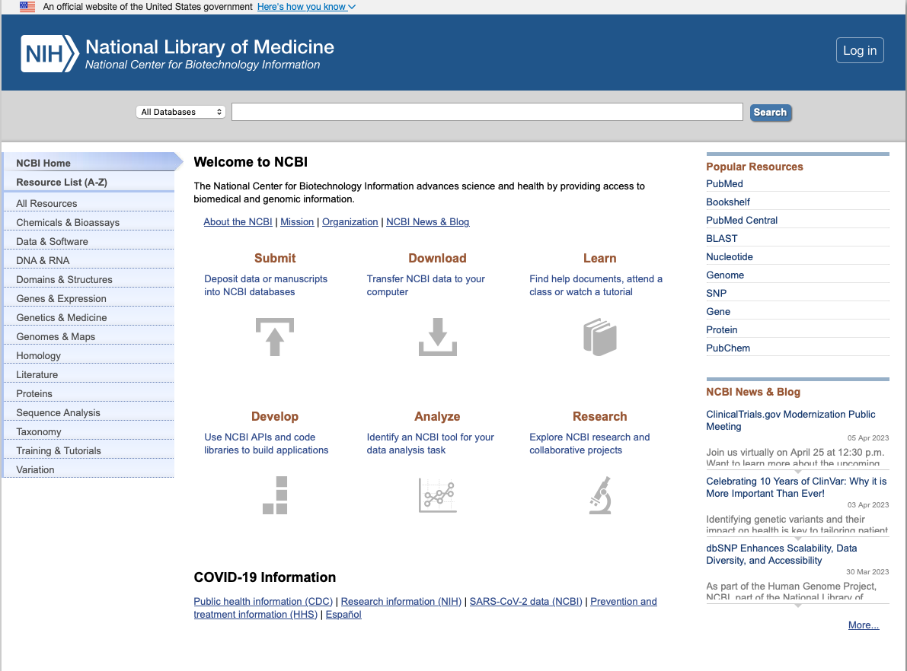
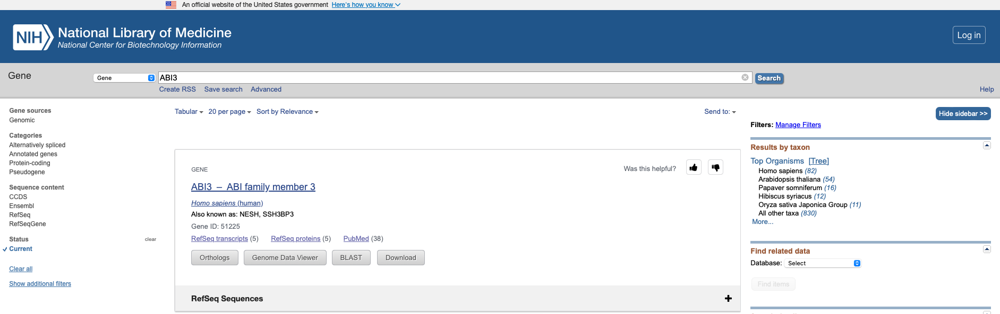

## Exploring the National Center for Biotechnology Information website

The [National Center for Biotechnology Information](https://www.ncbi.nlm.nih.gov) (NCBI) is a valuable resource for biomedical and genomic information. It is located in Bethesda (MD) and is founded in 1988 as a division of the [National Library of Medicine](https://www.nlm.nih.gov/socialmedia/index.html) (NLM), the largest biomedical library and part of the [National Institutes of Health](https://www.nih.gov) (NIH). On the NCBI website we can find multiple databases relevant to research in Genetics, being a important resource for Bioinformatics. There are two other very relevant sources of information: [DDBJ](https://www.ddbj.nig.ac.jp/) and [EMBL-EBI](https://www.ebi.ac.uk/). Together with NCBI they form the [International Nucleotide Sequence Database Collaboration](https://www.insdc.org) (INSDC), creating a synchronized database where we can find data from multiple experiments - from raw reads to complete details about studies.

Let's explore! Click [here](https://www.ncbi.nlm.nih.gov)

We can explore [genes](https://www.ncbi.nlm.nih.gov/gene/). As an example, we are going to search the gene coding for the protein [ABI3](https://www.ncbi.nlm.nih.gov/gene/51225):

Focusing on the *Arabidopsis thaliana* ABI3, we can explore the genomic region and products associated to this gene:

<iframe id="iframe_NCBI" width="1500" height="500" src="https://www.ncbi.nlm.nih.gov/projects/sviewer/embedded_iframe.html?iframe=iframe_NCBI&id=NC_003074.8&tracks=[key:sequence_track,name:T418951,display_name:Sequence,id:T418951,dbname:GenBank,annots:NA,ShowLabel:false,ColorGaps:false,shown:true,order:1][key:gene_model_track,name:T2595935,display_name:Genes\, RefSeq propagation from TAIR and Araport\, refreshed on 2022-10-20,id:T2595935,dbname:SADB,annots:NA000375140.1,Options:MergeAll,CDSProductFeats:false,NtRuler:true,AaRuler:true,HighlightMode:2,ShowLabel:true,shown:true,order:40][key:SNP_track,name:T2439100,display_name:(R) EVA RefSNP Release 3,id:T2439100,dbname:vcfTabix,annots:https\://ftp.ebi.ac.uk/pub/databases/eva/rs_releases/release_3/by_assembly/GCA_000001735.1/GCA_000001735.1_current_ids.vcf.gz,Layout:Adaptive,rmt_mapped_id:3,shown:true,order:50]&assm_context=GCF_000001735.4&app_context=Gene&v=8996797:9001756&c=null&select=null&slim=0&appname=no_appname" onload="if(!window._SViFrame){_SViFrame=true;window.addEventListener('message',function(e){if(e.origin=='https://www.ncbi.nlm.nih.gov' && !isNaN(e.data.h))document.getElementById(e.data.f).height=parseInt(e.data.h);});}">
</iframe>

There is a vast bibliography about ABI3 looking to [related articles in PubMed](https://pubmed.ncbi.nlm.nih.gov/?from_uid=822061&linkname=gene_pubmed).

Activity:

1.	Go to the [Gene](https://www.ncbi.nlm.nih.gov/gene/) database and look for a gene of your interest. You can search for a gene that you heard about before or take a look in recent news. Explore other features on NCBI, and in a document please explain the information you found in other databases (include pictures). In addition, please take a look in the literature, read and comment in forum at least one paper related to the gene you chose. For this last task, you can use [PubMed](https://pubmed.ncbi.nlm.nih.gov), [PubMed Central](https://www.ncbi.nlm.nih.gov/pmc/), [Web of Science](https://www.webofscience.com/wos/woscc/basic-search), [Google Scholar](https://scholar.google.com) or any other source of your preference.
