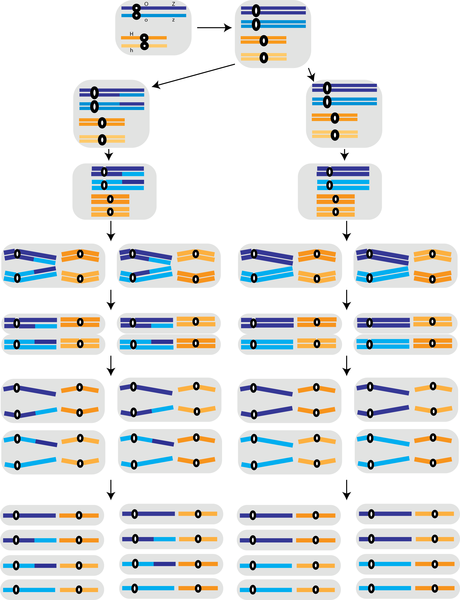

## Oh, Meiosis...

### Exercise 01

The diagram of the following figure represents a hypothetical cell with four chromosomes: a pair of long homologs and a pair of short homologs. The **O** locus, which has the alleles *O* and *o*, is in the long pair; the **H** locus, which has the alleles *H* and *h*, is in the short chromosomes. Assume that the genotype of the cell is **OoHh**, represent in the figure the segregation of those genes during the formation of the gametes. Identify and describe all the phases of the division indicated by the letters (ex: A- interphase: simple chromosomes, not paired). 

Fill in the table below with the percentages of gametes:

| **Genotype**  | **Frequency (%)**   |
|---------------|---------------------|
| O             |                     |
| o             |                     |
| H             |                     |
| h             |                     |
| ------------- | ------------------- |
| OH            |                     |
| Oh            |                     |
| oH            |                     |
| oh            |                     |

  
  

### Exercise 02

Now consider that the genes *O* (O, o) and *Z* (Z, z) are in the long pair and that *H* (H, h) is in the short pair. Suppose that crossing over occurs in **30%** of the cells, which are the possible **gametes and their frequencies**? Show all possible gametes using the figure below:

| **Genotype** | **Frequency (%)** |
|--------------|-------------------|
| O            |                   |
| o            |                   |
| H            |                   |
| h            |                   |
| Z            |                   |
| z            |                   |
| OH           |                   |
| Oh           |                   |
| oH           |                   |
| oh           |                   |
| OZ           |                   |
| Oz           |                   |
| oZ           |                   |
| oz           |                   |
| ZH           |                   |
| Zh           |                   |
| zH           |                   |
| zh           |                   |
| OZH          |                   |
| OZh          |                   |
| OzH          |                   |
| Ozh          |                   |
| oZH          |                   |
| oZh          |                   |
| ozH          |                   |
| ozh          |                   |

  
  

### Exercise 03

Draw the sub-stages of prophase I, including explanation of each one. Explain in which stage of prophase crossing over occurs and the importance of this cellular process.

  
  

## References

This activity was based on the General Genetics workbook of the [Department of Genetics](http://www.genetica.esalq.usp.br/en/) of the [Luiz de Queiroz College of Agriculture](https://www.en.esalq.usp.br).