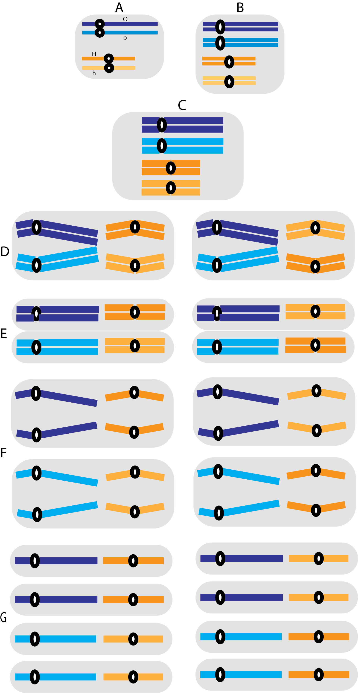
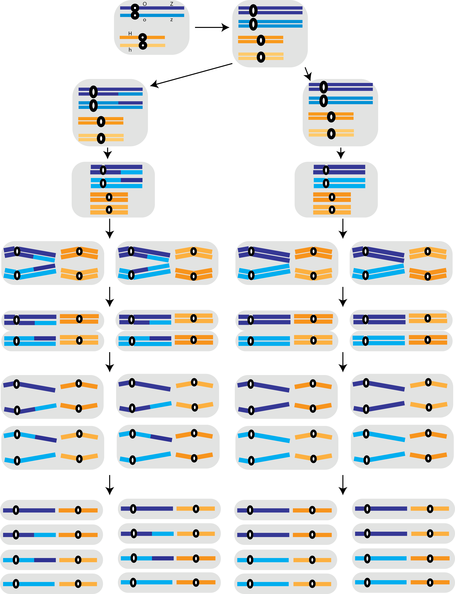

## Oh, Meiosis...

### Exercise 01

The diagram of the following figure represents a hypothetical cell with four chromosomes: a pair of long homologs and a pair of short homologs. The **O** locus, which has the alleles *O* and *o*, is in the long pair; the **H** locus, which has the alleles *H* and *h*, is in the short chromosomes. Assume that the genotype of the cell is **OoHh**, represent in the figure the segregation of those genes during the formation of the gametes. Identify and describe all the phases of the division indicated by the letters (ex: A- interphase: simple chromosomes, not paired). 

Fill in the table below with the percentages of gametes:

<table class="tg">
<thead>
  <tr>
    <th class="tg-yla0">Genotype</th>
    <th class="tg-yla0">Frequency (%)</th>
  </tr>
</thead>
<tbody>
  <tr>
    <td class="tg-cly1">O</td>
    <td class="tg-cly1"></td>
  </tr>
  <tr>
    <td class="tg-cly1">o</td>
    <td class="tg-cly1"></td>
  </tr>
  <tr>
    <td class="tg-cly1">H</td>
    <td class="tg-cly1"></td>
  </tr>
  <tr>
    <td class="tg-cly1">h</td>
    <td class="tg-cly1"></td>
  </tr>
  <tr>
    <td class="tg-cly1">-------------</td>
    <td class="tg-cly1">-------------------</td>
  </tr>
  <tr>
    <td class="tg-cly1">OH</td>
    <td class="tg-cly1"></td>
  </tr>
  <tr>
    <td class="tg-cly1">Oh</td>
    <td class="tg-cly1"></td>
  </tr>
  <tr>
    <td class="tg-cly1">oH</td>
    <td class="tg-cly1"></td>
  </tr>
  <tr>
    <td class="tg-cly1">oh</td>
    <td class="tg-cly1"></td>
  </tr>
</tbody>
</table>

  
  

### Exercise 02

Now consider that the genes *O* (O, o) and *Z* (Z, z) are in the long pair and that *H* (H, h) is in the short pair. Suppose that crossing over occurs in **30%** of the cells, which are the possible **gametes and their frequencies**? Show all possible gametes using the figure below:

  

<table class="tg">
<thead>
  <tr>
    <th class="tg-yla0">Genotype</th>
    <th class="tg-yla0">Frequency (%)</th>
  </tr>
</thead>
<tbody>
  <tr>
    <td class="tg-cly1">O</td>
    <td class="tg-cly1"></td>
  </tr>
  <tr>
    <td class="tg-cly1">o</td>
    <td class="tg-cly1"></td>
  </tr>
  <tr>
    <td class="tg-cly1">H</td>
    <td class="tg-cly1"></td>
  </tr>
  <tr>
    <td class="tg-cly1">h</td>
    <td class="tg-cly1"></td>
  </tr>
  <tr>
    <td class="tg-cly1">Z</td>
    <td class="tg-cly1"></td>
  </tr>
  <tr>
    <td class="tg-cly1">z</td>
    <td class="tg-cly1"></td>
  </tr>
  <tr>
    <td class="tg-cly1">OH</td>
    <td class="tg-cly1"></td>
  </tr>
  <tr>
    <td class="tg-cly1">Oh</td>
    <td class="tg-cly1"></td>
  </tr>
  <tr>
    <td class="tg-cly1">oH</td>
    <td class="tg-cly1"></td>
  </tr>
  <tr>
    <td class="tg-cly1">oh</td>
    <td class="tg-cly1"></td>
  </tr>
  <tr>
    <td class="tg-cly1">OZ</td>
    <td class="tg-cly1"></td>
  </tr>
  <tr>
    <td class="tg-cly1">Oz</td>
    <td class="tg-cly1"></td>
  </tr>
  <tr>
    <td class="tg-cly1">oZ</td>
    <td class="tg-cly1"></td>
  </tr>
  <tr>
    <td class="tg-cly1">oz</td>
    <td class="tg-cly1"></td>
  </tr>
  <tr>
    <td class="tg-cly1">ZH</td>
    <td class="tg-cly1"></td>
  </tr>
  <tr>
    <td class="tg-cly1">Zh</td>
    <td class="tg-cly1"></td>
  </tr>
  <tr>
    <td class="tg-cly1">zH</td>
    <td class="tg-cly1"></td>
  </tr>
  <tr>
    <td class="tg-cly1">zh</td>
    <td class="tg-cly1"></td>
  </tr>
  <tr>
    <td class="tg-cly1">OZH</td>
    <td class="tg-cly1"></td>
  </tr>
  <tr>
    <td class="tg-cly1">OZh</td>
    <td class="tg-cly1"></td>
  </tr>
  <tr>
    <td class="tg-cly1">OzH</td>
    <td class="tg-cly1"></td>
  </tr>
  <tr>
    <td class="tg-cly1">Ozh</td>
    <td class="tg-cly1"></td>
  </tr>
  <tr>
    <td class="tg-cly1">oZH</td>
    <td class="tg-cly1"></td>
  </tr>
  <tr>
    <td class="tg-cly1">oZh</td>
    <td class="tg-cly1"></td>
  </tr>
  <tr>
    <td class="tg-cly1">ozH</td>
    <td class="tg-cly1"></td>
  </tr>
  <tr>
    <td class="tg-cly1">ozh</td>
    <td class="tg-cly1"></td>
  </tr>
</tbody>
</table>

  
  

### Exercise 03

Draw the sub-stages of prophase I, including explanation of each one. Explain in which stage of prophase crossing over occurs and the importance of this cellular process.

  
  

## References

This activity was based on the General Genetics workbook of the [Department of Genetics](http://www.genetica.esalq.usp.br/en/) of the [Luiz de Queiroz College of Agriculture](https://www.en.esalq.usp.br).