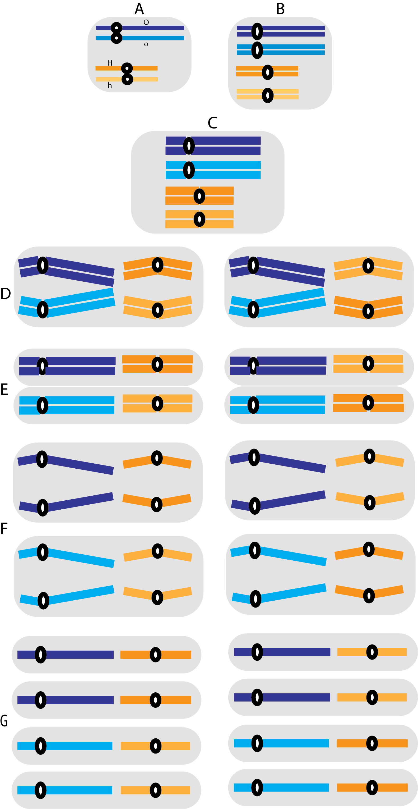

## Oh, Meiosis...

### Exercise 01

The diagram of the following figure represents a hypothetical cell with four chromosomes: a pair of long homologs and a pair of short homologs. The **O** locus, which has the alleles *O* and *o*, is in the long pair; the **H** locus, which has the alleles *H* and *h*, is in the short chromosomes. Assume that the genotype of the cell is **OoHh**, represent in the figure the segregation of those genes during the formation of the gametes. Identify and describe all the phases of the division indicated by the letters (ex: A- interphase: simple chromosomes, not paired). 

Fill in the table below with the percentages of gametes:

| **Genotype**  | **Frequency (%)**   |
|---------------|---------------------|
| O             |                     |
| o             |                     |
| H             |                     |
| h             |                     |
| ------------- | ------------------- |
| OH            |                     |
| Oh            |                     |
| oH            |                     |
| oh            |                     |

### Exercise 02

Now consider that the genes *O* (O, o) and *Z* (Z, z) are in the long pair and that *H* (H, h) is in the short pair. Suppose that crossing over occurs in 30% of the cells, which are the possible gametes and their frequencies? Show all possible gametes using the figure below:

## References

