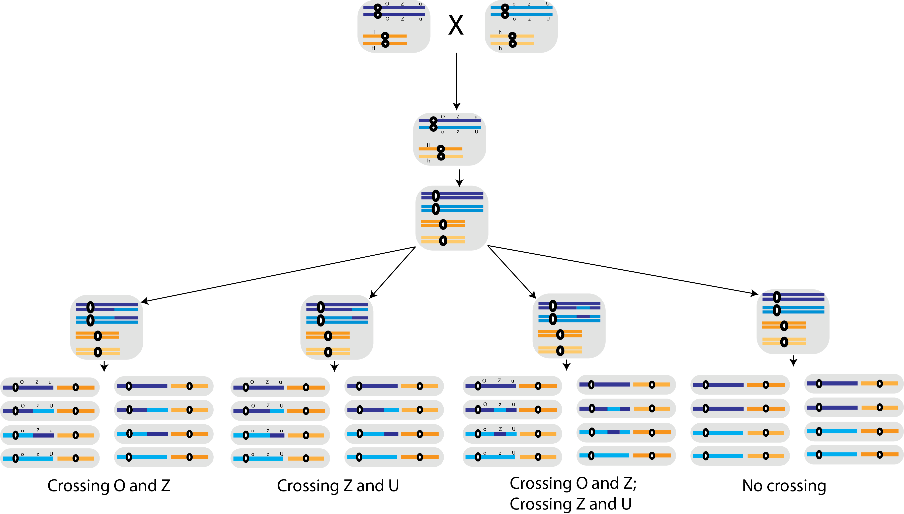

## Meiosis, again ...

Suppose a cross between two homozygous sugarcane lines generate a F1 progeny heterozygous for three recessive genes: u (abnormal leaf), o (susceptible to orange rust) and z (susceptible to sugarcane borer). The testcross of the F1 generation with complete recessive homozygous line generate

*	355 abnormal leaf, 
*	88 totally wild type - normal leaf, resistant to orange rust and resistant to the sugarcane borer, 
*	21 susceptible to sugarcane borer, 
*	339 susceptible to orange rust and susceptible to sugarcane borer, 
*	2 susceptible to orange rust, 
*	55 abnormal leaf, susceptible to orange rust and susceptible to sugarcane borer, 
*	17 abnormal leaf and susceptible to orange rust
*	2 abnormal leaf and susceptible to sugarcane borer

Fist, let's identify the genotypes of the offspring. We are just representing one chromosome as the other genotype used during the testcross is completely homozygous for the recessive alleles (genotype u,o,z/u,o,z - here the comas are to indicate that we still don't know the correct order):

*	355 u,O,Z
*	88 U,O,Z
*	21 U,O,z 
*	339 U,o,z
*	2 U,o,Z
*	55 u,o,z
*	17 u,o,Z
*	2 u,O,z

The next step is to identify the parental gametes (the most frequent in this offspring):

* P1: u,O,Z
* P2: U, o, z

We also know that double recombinants are the less frequent gametes. To know the order of genes, we compare the recombinant with the most similar parental type:

* U,o,Z (recombinant) and U,o,z (parental); 
* u,O,z (recombinant) and u,O,Z (parental)

In both cases, Z is the gene that changes. Therefore, Z is the gene located in the middle! We can now look at the parental genotypes and the resultant F1.

$$\frac{OZu}{OZu} \times \frac{ozU}{ozU}$$

We can look the following scheme to help us understand the origin of the gametes. There is an extra gene - H - but notice that it's independent from the other three genes. We will have four possible scenarios regarding the genes in the long chromosome: i) no crossing over; ii) a crossing over in between O and Z; iii) a crossing over in between Z and U; iv) two crossing overs. 

