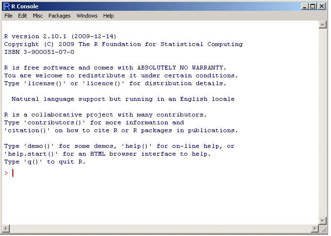

```{r setup, include=FALSE}
knitr::opts_chunk$set(echo = TRUE)
```

```{r knitr_init, echo=FALSE, cache=FALSE}
library(knitr)
## Global options
options(max.print="75")
opts_knit$set(width=75)
```

# Main tutorial

To return to the main tutorial click [here](R_training.html).

# Installation

R is available for Linux, macOS and Windows. Here we describe the steps to install R in each OS. If you experience problems in any step, please check the instructions on [CRAN](https://cran.r-project.org/). If the problems persist, please message me at `fernando [dot] hcorrer [at] gmail [dot] com`.

## Installing R on Ubuntu

Here we describe how to install R in two Ubuntu LTS (Long Term Support) distributions, but you can also find instruction for other distribution - Debian, Redhat and Suse - on [CRAN](https://cran.r-project.org).

To install R, we will follow some procedures. First, we need to update the indices and install helper packages. Next, we will add the signing key and add the R 4.0 repository from CRAN:

```{bash, eval=FALSE}
# update indices
sudo apt update -qq

# install two helper packages we need
sudo apt install --no-install-recommends software-properties-common dirmngr

# add the signing key (by Michael Rutter) for these repos
# To verify key, run gpg --show-keys /etc/apt/trusted.gpg.d/cran_ubuntu_key.asc 
# Fingerprint: E298A3A825C0D65DFD57CBB651716619E084DAB9
wget -qO- https://cloud.r-project.org/bin/linux/ubuntu/marutter_pubkey.asc | sudo tee -a /etc/apt/trusted.gpg.d/cran_ubuntu_key.asc

# add the R 4.0 repo from CRAN -- adjust 'focal' to 'groovy' or 'bionic' as needed
sudo add-apt-repository "deb https://cloud.r-project.org/bin/linux/ubuntu $(lsb_release -cs)-cran40/"

```

Now, we install R and its dependencies:

```{bash, eval=FALSE}
sudo apt install --no-install-recommends r-base
```

You can open R using the command line or clicking in the icon, after doing that you will see something like:



## Installing R on Windows

Download the file of R version 4.2.1 in this [link](https://cran.r-project.org/bin/windows/base/). Click twice in the .exe file and follow the instructions.

After finishing, click on the R icon to open the software.

### Windows - problems to install packages

Sometimes, on Windows, some packages do not work after installation. Maybe you will need to install [Rtools](https://cran.r-project.org/bin/windows/Rtools/). Download the proper version and follow the installing instructions.

## Installing R on macOS

Download the file of version 4.2.1 in this [link](https://cran.r-project.org/bin/macosx/). This webpage contains the binaries for base distribution and packages to run on Mac OS X systems (through Mac OS X 10.5). Click twice in the .pkg file and follow the instructions.

After finishing, click on the R icon to open the software.

# Installing RStudio

RStudio is a friendly interface for programming in R, as it has very practical features. RStudio can also be installed on Windows, macOS or Linux. To do that, select the installation file in the [website](https://www.rstudio.com/products/rstudio/download/).

For Linux based systems, the downloaded file has the extension `.deb` (Ubuntu) or `.rpm` (Fedora). Click twice in the file for the installation.

# RStudio cloud

If you prefer not installing R and RStudio in your personal computer, [RStudio cloud](https://rstudio.cloud/) is an interesting option for using them in your browser without installing anything. To access it, register at the [website](https://rstudio.cloud/). 

This is a practical platform, but has a disvantage in terms of RAM limitation. Then, processes that require more storage for processing will not be executed completely.